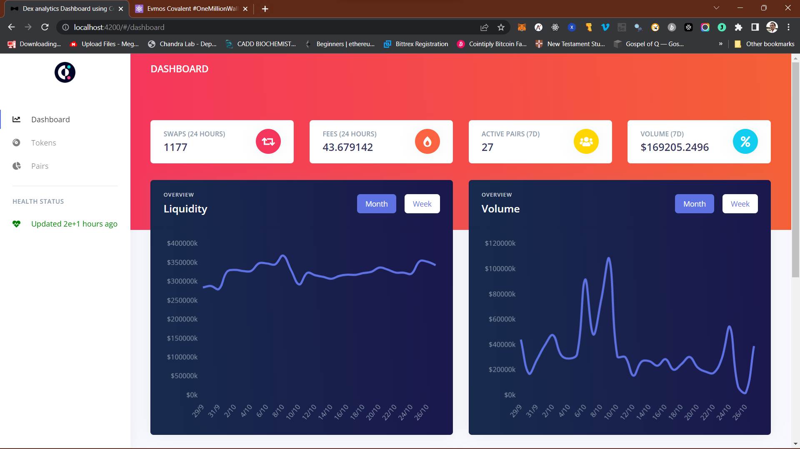
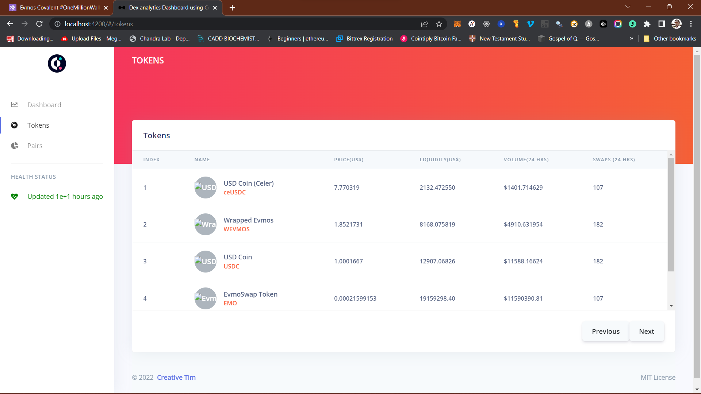
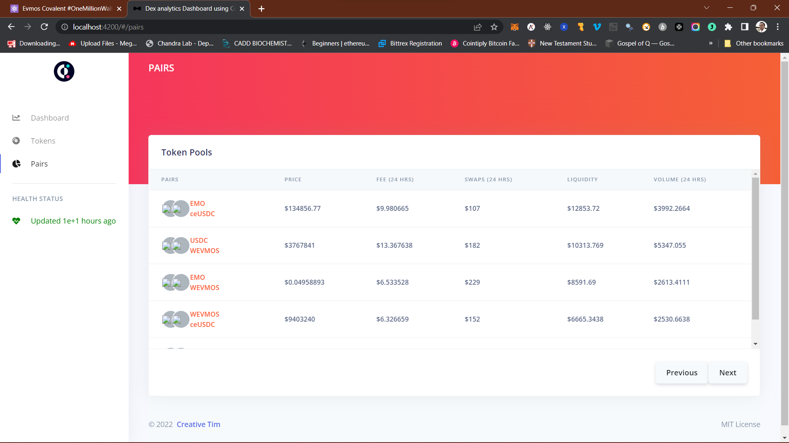

# DEX analytics dashboard using Covalent API On EVMOS Blockchain.

This project was built during Evmos Covalent #OneMillionWallets Hackathon

# Youtube Demo Video

[Video Link](https://youtu.be/-nuLzwLk7Vw)

# Live link

# Picture speaks

## Technology Stack
- Angular

## Key Benefits
- Unlike traditional organizations where only top board members get a vote in the decision making, a DAO includes all the members in the decision making process.
- This DEX analytics dashboard gives a detailed analysis of activities on EVMOS chain
- It provides a way to easily analize onchain data using Covalent APIs.
- Quick access to onchain Defi analysis.

# To run
- Clone repo
- npm install --legacy-peer-deps
- npm start